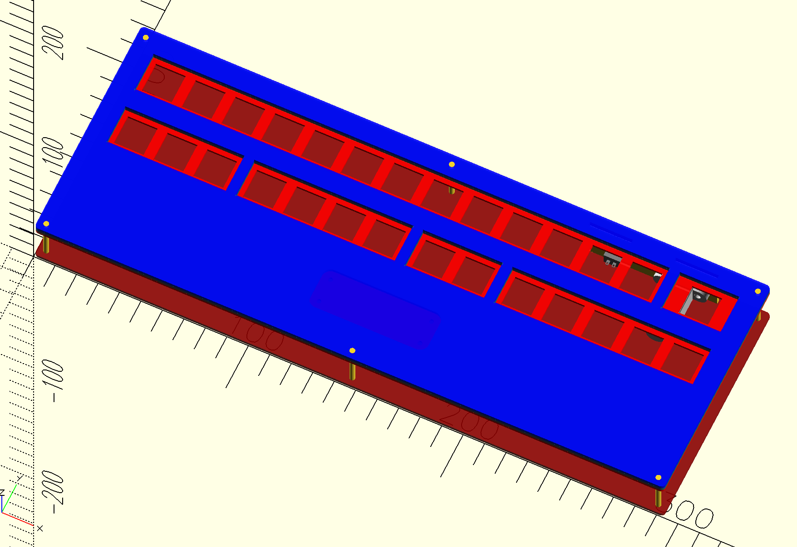
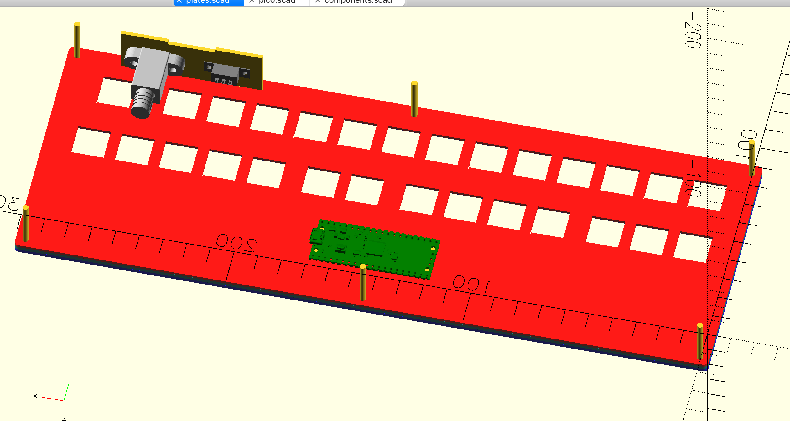

# Simple Mahjong Keypad

just messing around in OpenSCAD making a simple sandwich case, pls don't judge my bad code

intended for use with mame for playing random mahjong arcade games

uses the following layout for http://www.keyboard-layout-editor.com/ and http://builder.swillkb.com/ to generate plates

```
[{a:7},"A","B","C","D","E","F","G","H","I","J","K","L","M",{x:0.25,w:1.5},"N"],
[{y:1,fa:[1]},"START",{f:3},"COIN",{f:3},"BET",{x:0.25,f:2},"TAKE SCORE",{f:3},"BIG","DUP","SMALL",{x:0.25},"FLIP FLOP","LAST SHOT",{x:0.25},"KAN","PON","CHI",{fa:[2]},"RIICHI",{f:3},"RON"]
```


| Row Spacing | 3D Model | 3D Model Exploded |
|-------------|----------|-------------------|
| 0.5U | [link](https://3dviewer.net/index.html#model=https://github.com/iamevn/jong-keyboard/blob/main/export/plates%20-%200.5%20row%20spacing.stl) | [link](https://3dviewer.net/index.html#model=https://github.com/iamevn/jong-keyboard/blob/main/export/plates%20-%200.5%20row%20spacing%20-%20exploded.stl) |
| 0.75U | [link](https://3dviewer.net/index.html#model=https://github.com/iamevn/jong-keyboard/blob/main/export/plates%20-%200.75%20row%20spacing.stl) | [link](https://3dviewer.net/index.html#model=https://github.com/iamevn/jong-keyboard/blob/main/export/plates%20-%200.75%20row%20spacing%20-%20exploded.stl) |
| 1.0U | [link](https://3dviewer.net/index.html#model=https://github.com/iamevn/jong-keyboard/blob/main/export/plates%20-%201.0%20row%20spacing.stl) | [link](https://3dviewer.net/index.html#model=https://github.com/iamevn/jong-keyboard/blob/main/export/plates%20-%201.0%20row%20spacing%20-%20exploded.stl) |




